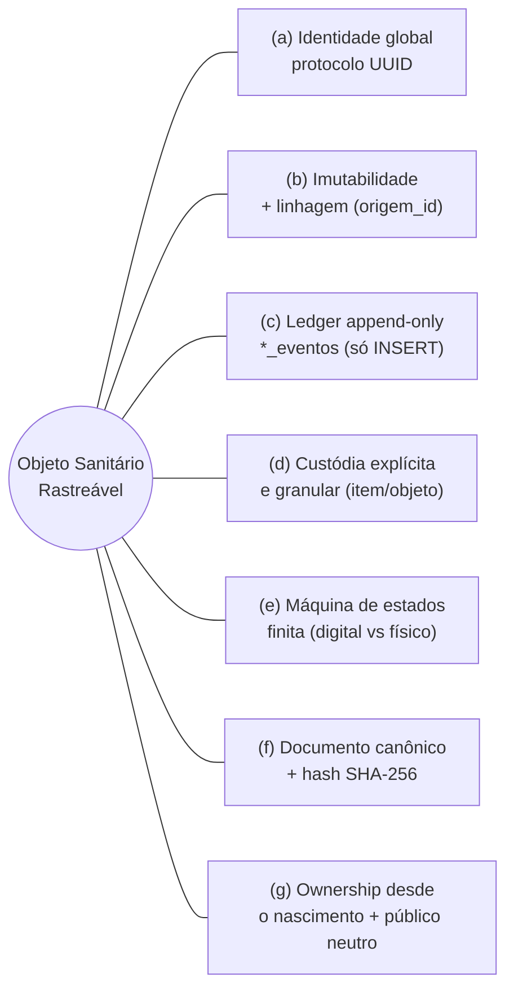
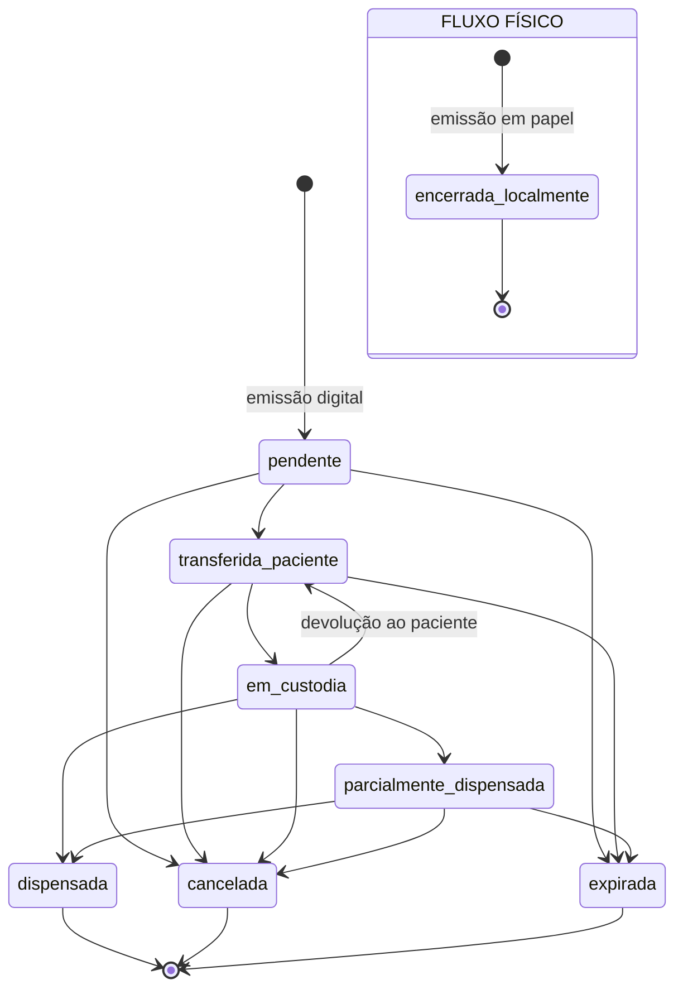
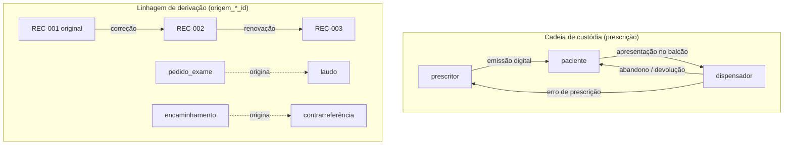

# Artefatos para o artigo CEBEB — figuras, Table I e métricas (verificados no código)

> Extraído de `backend/app/domain/states_*.py` e do repositório em 2026-06-14.
> **Todos os estados/transições abaixo são os reais** (não a simplificação do 1º draft).
> Mermaid + fallback em texto. Preenche as LACUNAs de Fig.1–3, Table I e §VI.

---

## §VI — Métricas da implementação de referência (preenche a LACUNA)

| Métrica | Valor |
|---|---|
| Linhas de código (`backend/app/`, sem testes) | ~31.700 |
| Routers (camada de API) | 32 |
| Models (ORM) | 43 |
| Endpoints (rotas) | 137 |
| Migrations Alembic (esquema único PG/SQLite) | 15 |
| **Tipos de objeto sanitário com máquina de estados própria** | **7** |
| Objetos com ledger append-only próprio (`*_eventos`) | 8 |
| Objetos com cadeia de custódia (`*_custodia`) | 5 |
| **Suíte de testes** | **1.341 funções de teste em 73 arquivos** |
| Gate de teste | dual-DB: SQLite + **PostgreSQL efêmero** (pega divergências invisíveis em SQLite) |

> ⚠️ Honestidade (para você decidir se entra no paper): o **gate de CI** (unit + integração
> selecionada contra Postgres) está verde; a suíte ampla SQLite tem ~16 falhas **pré-existentes**
> em módulos não relacionados (parsing de cert ICP, auth de integrador). Não afeta a tese, mas
> "1.341 testes, todos verdes" seria impreciso — prefira "1.341 testes; gate dual-DB de CI verde".

---

## TABLE I — Instâncias do núcleo (VERIFICADA; substitui a do draft)

| Objeto | Fluxo (estados reais) | Estados terminais | Cadeia de custódia |
|---|---|---|---|
| **Prescrição** | pendente → transferida_paciente → em_custodia → parcialmente_dispensada → dispensada | dispensada · cancelada · expirada · **encerrada_localmente** (físico) | prescritor → paciente → dispensador → (paciente \| prescritor) |
| **Pedido de exame** | emitido → agendado → coletado → em_analise → resultado_disponivel → encerrado | encerrado · cancelado · expirado · encerrado_fisico | prescritor → paciente → prestador_exame → paciente |
| **Laudo** | em_producao → assinado → liberado → ciencia_paciente / ciencia_prescritor → encerrado | encerrado · cancelado · expirado · encerrado_fisico | prestador_exame → (paciente \| prescritor) |
| **Agendamento** | criado → confirmado → realizado | realizado · cancelado · nao_compareceu | — *(nenhuma; compromisso bilateral — exceção documentada)* |
| **Circulação diagnóstica** | selecionado → enviado_laboratorio → proposta_recebida → confirmado_paciente → realizado | realizado · desmarcado_paciente · desmarcado_laboratorio · arquivado_laboratorio · expirado | paciente → laboratório *(mediada por token de apresentação)* |
| **Encaminhamento** | emitido → (em_regulacao) → agendado → atendido → contrarreferido → encerrado | encerrado · cancelado · expirado · **negado** · encerrado_fisico | prescritor(origem) → paciente → prescritor(destino) → paciente |
| **Contrarreferência** *(derivada)* | registrada | cancelada | destino → origem · `origem_encaminhamento_id` |

**Nota — Dispensação:** não é objeto próprio; é ato dentro do fluxo da prescrição, com a invariante
**Σ dispensado ≤ prescrito**. Variante hospitalar (subdomínio operacional): prescritor → farmácia
hospitalar → (unidade de enfermagem) → paciente.

**Correções vs. o draft:** (1) a prescrição tem 4 terminais, incluindo o físico `encerrada_localmente`;
(2) o laudo tem estados de *ciência* explícitos (paciente/prescritor); (3) o encaminhamento tem o
terminal específico `negado`; (4) a **circulação diagnóstica** é um 7º objeto (estava ausente da
Table I do draft) — vale incluir ou citar como instância adicional.

---

## FIGURE 1 — As sete propriedades invariantes do objeto sanitário rastreável

---

## FIGURE 2 — Ciclo de vida da prescrição (fluxo digital vs físico)

Fallback (texto): **Digital** — pendente → transferida_paciente → em_custodia →
{parcialmente_dispensada → dispensada}; `cancelada`/`expirada` alcançáveis de estados não-terminais;
`em_custodia → transferida_paciente` modela a devolução ao paciente (abandono). **Físico** — caminho
separado, terminal único `encerrada_localmente`, **sem** custódia digital.

---

## FIGURE 3 — Cadeia de custódia + linhagem de derivação

Fallback (texto): **Custódia** — detentor único a cada momento; transições declaradas
(prescritor→paciente→dispensador→paciente/prescritor); granularidade objeto-inteiro **ou** item.
**Linhagem** — correção/renovação encadeiam versões do mesmo artefato (`origem_prescricao_id`);
derivação **entre** objetos liga artefatos causalmente relacionados: laudo deriva de pedido de exame,
contrarreferência deriva de encaminhamento — cada derivação com **autor distinto, documento e hash
próprios**.

---

## Citações regulatórias — VERIFICADAS na web (fecha LACUNAs [6] e [12])

**[12] ANVISA, RDC nº 1.000/2025** — estabelece regras para a **prescrição eletrônica de
medicamentos sujeitos a controle especial**, retenção e notificação de receita, em território
nacional; altera pontos da **Portaria SVS/MS 344/98**. Foco em **rastreabilidade** e redução de
fraude via **assinatura digital obrigatória** e integração ao **SNCR (Sistema Nacional de Controle
de Receituários)**. Vigência para controlados a partir de **13/02/2026**; CPF do paciente
obrigatório; SNCR pleno previsto até **30/09/2026**. *(Confere com o uso no projeto — "RDC
1.000/2025" está correto.)*

**[6] Resolução CFM nº 2.299/2021** — regulamenta a **emissão de documentos médicos eletrônicos**;
publicada no **DOU de 26/10/2021** (aprovada em 30/09/2021), em vigor após 60 dias (~25/12/2021). O
**Art. 4º** exige **assinatura digital ICP-Brasil com NGS2** (Nível de Garantia de Segurança 2),
garantindo validade jurídica, autenticidade, autoria e **não-repúdio**. *(Confere com o draft —
"[6] CFM 2.299/2021 mandates ICP-Brasil signing" está correto.)*

> Fontes: gov.br/anvisa (webinar RDC 1.000/2025); Anfarmag / ITI / CFM (Resolução 2.299/2021,
> Art. 4º). Verificado em 2026-06-14.

---

## Parágrafo de métodos — o gate dual-DB (sugestão de redação p/ §VI)

> The reference implementation runs on PostgreSQL in production and SQLite in development under a
> single Alembic-managed schema. A **dual-database test gate** executes the suite against an
> ephemeral PostgreSQL instance, not only against SQLite. This is not redundant: SQLite's permissive
> typing (e.g., accepting an integer literal for a boolean column, or lax NULL handling) silently
> masks defects that surface only under PostgreSQL's strict typing. In our development this gate
> repeatedly caught latent defects that were **invisible on SQLite** — for instance, a boolean column
> written with an integer literal passed every SQLite test yet raised a type-mismatch error on
> PostgreSQL, meaning a code path that *appeared* fully tested was in fact broken under
> production-equivalent conditions. The methodological claim is narrow but practical: for
> dual-database clinical systems, **the production database must be inside the test gate** — a green
> bar on the development database is necessary but not sufficient.

*(Honesto e vivido: foi exatamente assim que pegamos os bugs `dose_unitaria` e `ativo` — invisíveis
em SQLite, quebrados na PG. É, possivelmente, a contribuição de engenharia mais defensável do paper.)*

---

## REFERÊNCIAS — lista verificada na web (fecha as LACUNAs de [3]–[10], [12])

Confere/preenche a seção References do draft (estilo IEEE). ✓ = dados confirmados.

- **[3]** ✓ G. C. Coelho Neto, R. Andreazza, A. Chioro, "Integration among national health information
  systems in Brazil: the case of e-SUS Primary Care," *Rev. Saúde Pública*, vol. 55, art. 93, 2021.
  **doi:10.11606/s1518-8787.2021055002931** (PMID 34878089).
- **[4]** ✓ I. M. P. Barbalho *et al.*, "Electronic health records in Brazil: Prospects and
  technological challenges," *Front. Public Health*, vol. 10, art. 963841, 2022.
  **doi:10.3389/fpubh.2022.963841**.
- **[5]** ✓(título/veículo) "Digital Health: Context and Challenges in Brazil with Focus on Public
  Health," *Proc. IEEE INDUSCON*, 2025. **IEEE Xplore doc. 11241578**. *(Conferir a grafia dos
  autores direto no Xplore — o snippet não confirmou "L. F. Conrado".)*
- **[6]** ✓ Conselho Federal de Medicina, *Resolução CFM nº 2.299/2021*, DOU 26/10/2021. Art. 4º
  exige assinatura **ICP-Brasil NGS2** (autenticidade, autoria, não-repúdio).
- **[7]** M. Fowler, "Event Sourcing," martinfowler.com, dez. 2005. *(citação canônica)*
- **[8]** ✓ "Blockchain-Enabled Traceability in Pharmaceutical Supply Chains: A Mapping Review of
  Evidence for Visibility, Anti-Counterfeiting, and Chain-of-Custody Control," *Logistics*, vol. 10,
  no. 4, art. 85, 2024. **doi:10.3390/logistics10040085** *(autores: preencher do DOI)*.
- **[9]** U.S. FDA, *Drug Supply Chain Security Act (DSCSA)*, Title II of Pub. L. 113-54, 2013; e
  Parlamento Europeu, *Diretiva 2011/62/UE (Falsified Medicines Directive)*, 2011 + Reg. Delegado
  (UE) 2016/161. *(referências legais estáveis)*
- **[10]** ✓ **A. Duarte, J. Frost, L. Gambacorta, P. Koo Wilkens, H. S. Shin, "Central banks, the
  monetary system and public payment infrastructures: lessons from Brazil's Pix," BIS Bulletin
  No. 52, Bank for International Settlements, mar. 2022.** *(É a citação canônica de "Pix como
  infraestrutura pública de pagamento" — ideal para a metáfora.)* Alternativa: IMF, "Pix: Brazil's
  Successful Instant Payment System," *IMF Staff Country Report* 2023/289, 2023.
- **[11]** Brasil, *Lei nº 13.709/2018 (LGPD)*, Art. 11. *(confirmado — dado pessoal sensível)*
- **[12]** ✓ ANVISA, *RDC nº 1.000/2025* — prescrição eletrônica de medicamentos sob controle
  especial; rastreabilidade + assinatura digital + SNCR; altera a Portaria 344/98. Vigência
  13/02/2026.

> **Resta verificar só:** datas de acesso de [1][2] (links RNDS gov.br) e a grafia dos autores de
> [5] e [8]. Todo o resto está confirmado com fonte.

---

*Fonte: `backend/app/domain/states_{prescricao,exame,laudo,agendamento,circulacao_diagnostica,encaminhamento,contrarreferencia}.py`.
Métricas de `backend/app` e `backend/tests`. Citações regulatórias e referências verificadas na web. Verificado em 2026-06-14 — nada inventado.*
