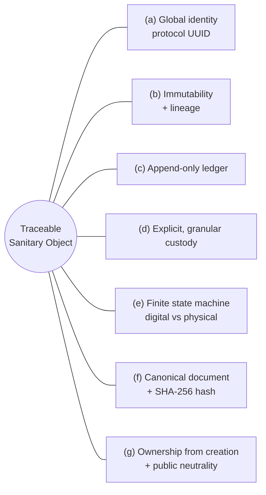
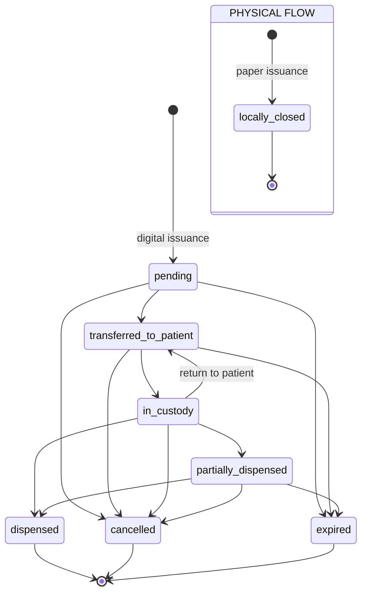
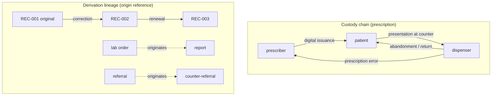

# From Pix to Care Rails: A Common Architectural Core for Prescriptions, Lab Orders, Reports, and Dispensing

**[AUTHOR BLOCK — LACUNA: Fabiano Tonaco Borges, CTG/UFPE + co-authors, affiliations, emails, ORCID]**

---

**Abstract**—Health informatization in Brazil's public system (SUS) has advanced data interoperability (RNDS, e-SUS, FHIR), yet the traceability of the *objects* of care—prescriptions, lab orders, reports, appointments, referrals, and dispensing events—remains fragmented, with weak auditability and implicit custody. This paper proposes the **traceable sanitary object** as an architectural pattern: an abstraction defined by seven invariant properties—global identity (UUID), immutability after issuance, an append-only ledger, explicit and granular custody, a finite state machine, a canonical document with a cryptographic hash, and ownership from creation. We show that prescriptions, lab orders, reports, appointments, and dispensing are instances of the same core, with derived objects linked by referential lineage. Institutional operation is contextual while the clinical object stays global and neutral—analogous to the open settlement rails of Brazil's Pix payment system. We present a reference implementation (Python/FastAPI; PostgreSQL/SQLite with a dual-database test gate), the guarantees the model entails (a non-repudiable audit trail; dispensed ≤ prescribed), and its ethical-regulatory posture (neutral public endpoints under LGPD Art. 11; AGPL open source). This is a proof-of-concept; ICP-Brasil signing and an external event-publishing layer are future work.

**Index Terms**—append-only ledger, audit trail, chain of custody, electronic prescription, health information interoperability, software architecture.

---

## I. INTRODUCTION

Brazil's Unified Health System (SUS) has invested heavily in the digital exchange of health data. The National Health Data Network (RNDS) adopts the HL7 FHIR standard to consolidate records from heterogeneous institutions into a distributed, national interoperability layer [1], [2]. Yet empirical assessments show that integration across national health information systems is still partial and fragmented [3], and reviews of electronic health records (EHR) in Brazil repeatedly identify interoperability and security as the dominant open problems [4], [5]. Crucially, these efforts target the exchange of clinical *data*, not the traceability of the clinical *objects* that carry the act of care.

A prescription, a lab order, a report, an appointment, a referral and a dispensing event are not merely data: they are artifacts that are issued, transferred, held, acted upon, and closed. When such artifacts lack end-to-end traceability and explicit custody, basic accountability questions become hard to answer: who issued the object, who held it at each moment, what happened to it, and whether its content was altered. These questions are simultaneously a clinical-safety concern and a regulatory one—Brazilian Federal Council of Medicine Resolution CFM 2.299/2021 requires that digitally issued medical documents be signed with an ICP-Brasil certificate, precisely to guarantee authorship, integrity and authenticity [6].

Brazil offers a striking precedent in another public domain. Pix, the instant-payment system operated by the Central Bank, was designed from the outset as open public infrastructure: standardized APIs, common rules, and equal access for banks, fintechs, governments and new entrants. In Pix, the object—a transfer—is global and neutral, addressed by a portable key, while the regulated settlement rails are the shared substrate on which any participant operates. The model has drawn international attention as an example of payments treated as public infrastructure [10]. We argue that public health lacks equivalent open rails for its own objects: there is no shared, neutral substrate on which a sanitary object can be issued once and then traced, audited and acted upon across institutions.

This paper proposes the **traceable sanitary object** as an architectural pattern that supplies exactly such a substrate at the application-architecture level. The pattern defines an object that carries its own identity, immutability, ledger, custody chain, state machine, canonical document and ownership—independently of any single institution. Our claimed contribution is the pattern itself (the core), demonstrated through an open-source reference implementation, PicSaúde, rather than a product. We are explicit that PicSaúde is a proof-of-concept and not a system deployed at clinical scale.

The remainder of the paper is organized as follows. Section II reviews related work. Section III defines the conceptual model and its seven invariant properties. Section IV details the architecture. Section V demonstrates generalization across clinical objects. Section VI describes the implementation and the guarantees the model entails. Section VII discusses trade-offs, ethics and limitations, and Section VIII concludes.

## II. RELATED WORK

**National health-data infrastructure.** The dominant line of work in Brazil concerns semantic and syntactic interoperability of clinical data. RNDS standardizes exchange through HL7 FHIR resources and controlled terminologies [1], [2]. Studies of the e-SUS Primary Care strategy quantify how national information systems remain only partially integrated, with persistent fragmentation across care and surveillance domains [3]. Broader reviews of EHR development in Brazil conclude that interoperability is considered essential by most authors, while also flagging access-control and data-security gaps and the absence of accurate test data [4]; comparative analyses across Latin America emphasize governance continuity as a recurring weakness [5]. This body of work is centered on moving *data* between systems, not on giving each clinical artifact an auditable life cycle.

**Electronic prescription and digital signature.** Resolution CFM 2.299/2021 and related norms define the digital issuance of medical documents and mandate ICP-Brasil signing for authorship, integrity and authenticity [6]. These norms specify what a valid signed document must contain, but not an architecture for tracing the object after issuance or for transferring its custody between actors.

**Event sourcing and append-only ledgers.** Outside health care, event sourcing is an established pattern in which state changes are captured as immutable events in an append-only store that doubles as a complete audit trail [7]. Hash-chaining and per-writer signatures extend this to tamper-evident, multi-writer provenance. We adopt this pattern internally as the *ledger* property of the sanitary object.

**Track-and-trace and chain of custody.** In the pharmaceutical supply chain, blockchain-based and serialization-based approaches provide tamper-evident chain-of-custody from manufacturer to dispensing point, often motivated by regulation such as the U.S. DSCSA and the EU FMD [8], [9]. This work traces physical product units across organizations; our pattern instead traces *clinical* objects (and their items) across *clinical roles*, and does so without requiring a distributed ledger or shared consensus.

**Positioning.** Prior art addresses, separately, data interoperability, signed-document compliance, generic event sourcing, and supply-chain track-and-trace. The contribution of this paper is a unifying *domain* pattern for heterogeneous clinical objects—one that combines global identity, immutability with referential lineage, an append-only ledger, explicit and granular custody, a finite state machine, a canonical document with hash, and ownership from creation—expressed at the level of application architecture and instantiable on conventional relational infrastructure.

## III. THE TRACEABLE SANITARY OBJECT

We define a *traceable sanitary object* as any artifact of care that has its own clinical identity and an auditable life cycle. The pattern is characterized by seven invariant properties. **Fig. 1** summarizes the abstraction.

> **FIGURE 1** — The traceable sanitary object and its seven invariant properties (insert rendered image; Mermaid source in Appendix).

**(a) Global identity.** Every object carries a *protocol* (a UUID) that is unique, immutable and independent of any institution. The protocol—not an institutional key—is the primary handle through which the object is referenced, audited and shared, in direct analogy to a portable Pix key.

**(b) Immutability with lineage.** An object is never edited after issuance. Any correction, renewal or re-issuance produces a new *derived* object that points back to its predecessor through an origin reference, forming an explicit lineage chain. Audit therefore never loses history: the original and each derivation coexist.

**(c) Append-only ledger.** Every business-relevant event is recorded as an insertion into an events table that never receives updates or deletions. This internal event-sourcing log is the backbone of auditability: the sequence of events is, by construction, complete and non-destructive.

**(d) Explicit, granular custody.** Each object has a single custodian at every moment, and every transfer of custody is recorded in a custody chain. Custody is granular: it can be held over an entire object or over an individual item, which is what makes partial flows (e.g., partial dispensing) traceable.

**(e) Finite state machine.** Each object type has an explicit set of states and valid transitions, with terminal states distinguished by clinical meaning. A *digital* flow (which participates in custody and downstream acts) is kept separate from a purely *physical* flow (paper issuance that never enters the digital cycle), avoiding category errors between, for instance, a clinical revocation and a paper-only closure.

**(f) Canonical document with hash.** The object is serialized deterministically into a canonical document from which a SHA-256 digest is computed. This digest is the integrity anchor and the basis for ICP-Brasil signing under the PAdES profile; in the current proof-of-concept the signing step is a stub (see Section VII).

**(g) Ownership from creation and public neutrality.** Access control and an inline identity assertion are enforced on every private endpoint from the moment the object is created. Public endpoints are kept neutral—carrying no clinical data—so that verification can be offered without exposing sensitive information, consistent with LGPD Art. 11 on sensitive personal data [11].

## IV. ARCHITECTURE

The architecture realizes the seven properties on a conventional relational stack. We describe each mechanism in turn; **Fig. 2** shows the prescription life-cycle state machine and **Fig. 3** the custody chain together with derivation lineage.

> **FIGURE 2** — Prescription life-cycle state machine (digital vs physical flow). **FIGURE 3** — Custody chain + derivation lineage. (Insert rendered images; Mermaid sources in Appendix.)

*A. Immutable ledger.* Each object family has an events table (for example, the prescription event ledger) that admits only insertions. A controlled vocabulary of events—issuance, renewal, correction, custody transfer, dispensing, partial dispensing, item return, and so on—is recorded with actor, timestamp and payload. Because no update or deletion is permitted, the ledger provides a non-destructive, append-only history that underpins every audit query.

*B. Granular custody.* A custody table records the current holder and every transition. Valid transitions are declared explicitly (e.g., prescriber → patient on digital issuance; patient → dispenser on presentation at the counter; dispenser → patient on return). Custody may be recorded for an entire object or for an individual item, enabling partial flows without invalidating the parent object.

*C. Finite state machine.* Allowed states and transitions are declared in a single domain module that serves as the source of truth, mirrored in the database schema. Digital states (pending, transferred-to-patient, in-custody, partially-dispensed, dispensed, cancelled) are separated from the physical terminal state used for paper-only issuance. Terminal states are explicit and semantically distinct, so that a clinical revocation can never be confused with a paper-only closure.

*D. Canonical document and integrity.* A dedicated module produces the canonical serialization and its SHA-256 digest. The digest is stored with the object and exposed through a document-integrity endpoint, allowing any holder to verify that the content has not changed. The same digest is the intended input to ICP-Brasil PAdES signing.

*E. Ownership, RBAC and public neutrality.* Every private endpoint enforces role-based access control and an inline identity assertion, so that ownership is checked at creation and at each subsequent act. Public endpoints expose only non-clinical confirmation data, keeping the public surface neutral and LGPD-compliant [11].

*F. Institutional scope.* Operation is made contextual through optional organization and unit identifiers. The clinical object remains global and neutral—identified by its protocol—while these identifiers act as query scope, access filter and operational context, never as the primary key. A NULL value denotes the absence of an institutional link (not a sentinel), and the fields are rolled out incrementally, table by table, only when a real use case requires them. Where an organization identifier is present, read and write queries in an institutional context must include it as a filter, enforced as an architectural guardrail.

## V. GENERALIZATION OF THE CORE

The pattern is a *core*, not an exception: the same seven properties instantiate multiple clinical objects. **Table I** summarizes representative objects, their states, and their custody chains, as realized in the reference implementation.

**TABLE I. Instances of the traceable-sanitary-object core**

| Object | Typical states (digital flow) | Terminal states | Custody chain |
|---|---|---|---|
| Prescription | pending → transferred-to-patient → in-custody → partially-dispensed → dispensed | dispensed; cancelled; expired; locally-closed *(physical)* | prescriber → patient → dispenser → (patient \| prescriber) |
| Lab order | issued → scheduled → collected → under-analysis → result-available → closed | closed; cancelled; expired; physically-closed | prescriber → patient → lab provider → patient |
| Report | in-production → signed → released → acknowledged *(patient/prescriber)* → closed | closed; cancelled; expired; physically-closed | lab provider → (patient \| prescriber) |
| Appointment | created → confirmed → carried-out | carried-out; cancelled; no-show | *none (bilateral commitment — documented exception)* |
| Diagnostic circulation | selected → sent-to-lab → proposal-received → patient-confirmed → performed | performed; patient-unmarked; lab-unmarked; lab-archived; expired | patient → lab *(token-mediated)* |
| Referral | issued → (under-regulation) → scheduled → attended → counter-referred → closed | closed; cancelled; expired; **denied**; physically-closed | prescriber (origin) → patient → prescriber (destination) → patient |
| Counter-referral *(derived)* | registered | cancelled | destination → origin *(origin-referral reference)* |

*Dispensing* is not a standalone object but an act within the prescription flow, governed by the invariant **Σ dispensed ≤ prescribed**; its hospital variant follows prescriber → hospital pharmacy → (nursing unit) → patient.

**Derived objects.** Derivation generalizes beyond corrections and renewals. A *report* is a derived object of a *lab order*, and a *counter-referral* is a derived object of a *referral*: each derivation has a distinct author, its own canonical document and hash, and a referential link to its origin. The lineage chain thus spans not only versions of one artifact but causally related artifacts across the care pathway.

**Documented exceptions.** Some objects intentionally relax one property, and recording the exception is part of the discipline. Appointments are lightweight objects with identity, states and a ledger but no custody chain, because they represent a bilateral commitment rather than a held artifact. Acknowledgement of a report operates at the level of the whole report rather than per item. Diagnostic circulation authorizes the act through a presentation token rather than a custody transfer. Naming these exceptions explicitly is what keeps the core coherent.

## VI. IMPLEMENTATION AND GUARANTEES

**Stack and scale.** The reference implementation uses Python with FastAPI for the API layer and a relational store that runs on PostgreSQL in production and SQLite in development under a single Alembic-managed schema. It comprises roughly 31,700 lines of application code across 32 routers and 43 ORM models, exposing 137 endpoints over 15 schema migrations. Seven types of sanitary object each carry their own finite state machine; eight maintain their own append-only event ledger and five maintain explicit custody chains. The test suite comprises 1,341 test functions across 73 files.

**Dual-database test gate.** A dual-database gate executes the suite against an *ephemeral PostgreSQL* instance in addition to SQLite. This is not redundant: SQLite's permissive typing (for example, accepting an integer literal for a boolean column, or lax NULL handling) silently masks defects that surface only under PostgreSQL's strict typing. In our development this gate repeatedly caught latent defects that were invisible on SQLite—for instance, a boolean column written with an integer literal passed every SQLite test yet raised a type-mismatch error on PostgreSQL, meaning a code path that *appeared* fully tested was in fact broken under production-equivalent conditions. The methodological claim is narrow but practical: for dual-database clinical systems, the production database must be inside the test gate—a green bar on the development database is necessary but not sufficient.

**Guarantees from the model.** Several safety properties follow directly from the pattern rather than from ad-hoc checks. Partial dispensing cannot exceed the prescription because the sum of dispensed quantities for an item is constrained to be less than or equal to the prescribed quantity; an item that cannot be paid for simply returns to a pending state and remains dispensable elsewhere, without cancelling the prescription. Immutability together with the append-only ledger yields a non-repudiable audit trail: history is never overwritten, only extended. Terminal-state semantics are kept distinct, so a clinical cancellation is never conflated with a paper-only closure. Access control is enforced from creation, and public endpoints are neutral by construction, so verification never discloses clinical content.

**Regulatory and licensing posture.** The design targets compliance with ANVISA RDC nº 1.000/2025—which governs the electronic prescription of medications under special control, emphasizing traceability, mandatory digital signature and integration with the National Controlled-Prescription System (SNCR), and which amends Ordinance SVS/MS 344/98—and with CFM 2.299/2021 [6], [12]. The reference implementation is released as open source under the AGPL, on the principle that infrastructure for a public health system should itself be public. The architecture is the subject of a Brazilian INPI filing (BR 51 2026 002267-3).

## VII. DISCUSSION, LIMITATIONS, AND ETHICS

**Trade-offs.** Physical (paper-only) issuance uses a fire-and-forget call: the front end prints without waiting for the back end to confirm persistence. This favors availability of the clinical act over guaranteed central registration—if the back end is offline, printing still succeeds and the record may remain only on the client. The trade-off is accepted and documented; full traceability requires the back end to be reachable. Similarly, a mathematically invalid sentinel identifier is reserved for unidentified patients in paper flows and must be excluded from analytics, and institutional scope is rolled out incrementally rather than imposed on every table at once.

**Ethics.** A non-negotiable non-goal of the project is that patient health data is never monetized. The aim is citizen sovereignty over health objects through auditable grants of access, never the sale of data. This principle is treated as a design constraint rather than a policy statement.

**Limitations.** This is a proof-of-concept and has not been deployed at clinical scale. ICP-Brasil signing is currently a stub: the canonical document and hash exist, but production-grade signing and verification are not yet integrated. The system is event-sourced internally but is not yet event-driven externally—there is no event-publishing layer, so external adapters (HIS, TISS, HL7, e-SUS) have no integration point yet and are deferred until that layer exists. Several flows are MVP simplifications (for example, treating an appointment as carried-out as equivalent to specimen collection). Finally, the evaluation in this paper is architectural; empirical validation in a real care setting remains future work.

## VIII. CONCLUSION AND FUTURE WORK

We have argued that the objects of care—prescription, lab order, report, appointment, referral and dispensing—share a single architectural contract, and we have formalized that contract as the *traceable sanitary object*: a pattern defined by global identity, immutability with lineage, an append-only ledger, explicit and granular custody, a finite state machine, a canonical document with hash, and ownership from creation. Treating these artifacts as instances of one core is what yields traceability, auditability and the basis for cross-institutional interoperability—the open rails that public health still lacks, by analogy to what Pix provided for payments. Future work includes full ICP-Brasil signing, an event-publishing layer with webhooks to enable external adapters, a municipal pilot, and empirical validation of the model in a real care setting.

## REFERENCES

[1] Ministério da Saúde, "Rede Nacional de Dados em Saúde (RNDS)," Guia de Integração. [Online]. Available: https://rnds-guia.saude.gov.br/. **[LACUNA: access date]**

[2] Ministério da Saúde, "RNDS — HL7 FHIR implementation guide." [Online]. Available: https://rnds-fhir.saude.gov.br/. **[LACUNA: access date]**

[3] G. C. Coelho Neto, R. Andreazza, and A. Chioro, "Integration among national health information systems in Brazil: the case of e-SUS Primary Care," *Revista de Saúde Pública*, vol. 55, art. 93, 2021, doi:10.11606/s1518-8787.2021055002931.

[4] I. M. P. Barbalho *et al.*, "Electronic health records in Brazil: Prospects and technological challenges," *Frontiers in Public Health*, vol. 10, art. 963841, 2022, doi:10.3389/fpubh.2022.963841.

[5] "Digital Health: Context and Challenges in Brazil with Focus on Public Health," in *Proc. IEEE INDUSCON*, 2025, IEEE Xplore doc. 11241578. **[LACUNA: confirm author list on IEEE Xplore]**

[6] Conselho Federal de Medicina, *Resolução CFM nº 2.299/2021*, Diário Oficial da União, 26 Oct. 2021. (Art. 4: ICP-Brasil digital signature, NGS2.)

[7] M. Fowler, "Event Sourcing," martinfowler.com, Dec. 2005. [Online]. Available: https://martinfowler.com/eaaDev/EventSourcing.html

[8] "Blockchain-Enabled Traceability in Pharmaceutical Supply Chains: A Mapping Review of Evidence for Visibility, Anti-Counterfeiting, and Chain-of-Custody Control," *Logistics*, vol. 10, no. 4, art. 85, 2024, doi:10.3390/logistics10040085. **[LACUNA: author list from DOI]**

[9] U.S. Food and Drug Administration, *Drug Supply Chain Security Act (DSCSA)*, Title II of the Drug Quality and Security Act, Pub. L. 113-54, 2013; European Parliament and Council, *Directive 2011/62/EU (Falsified Medicines Directive)*, 2011, and Commission Delegated Regulation (EU) 2016/161.

[10] A. Duarte, J. Frost, L. Gambacorta, P. Koo Wilkens, and H. S. Shin, "Central banks, the monetary system and public payment infrastructures: lessons from Brazil's Pix," *BIS Bulletin* No. 52, Bank for International Settlements, Mar. 2022.

[11] Brasil, *Lei nº 13.709/2018 (Lei Geral de Proteção de Dados Pessoais — LGPD)*, Art. 11.

[12] ANVISA, *Resolução de Diretoria Colegiada — RDC nº 1.000/2025* (prescrição eletrônica de medicamentos sob controle especial; integração ao SNCR; alteração da Portaria SVS/MS 344/98), 2025.

---

## APPENDIX — Figure sources (Mermaid; render to image for submission)

**Fig. 1 — Seven invariant properties**

**Fig. 2 — Prescription life-cycle (digital vs physical)**

**Fig. 3 — Custody chain + derivation lineage**

---

*Integrated manuscript. Conceptual body from the Cowork draft; Table I, §VI metrics, the dual-database methods paragraph, regulatory citations and the reference list verified against `PicSaúde` source code and web sources on 2026-06-14. Remaining LACUNAs require the authors: author block, access dates [1][2], author lists [5][8].*
